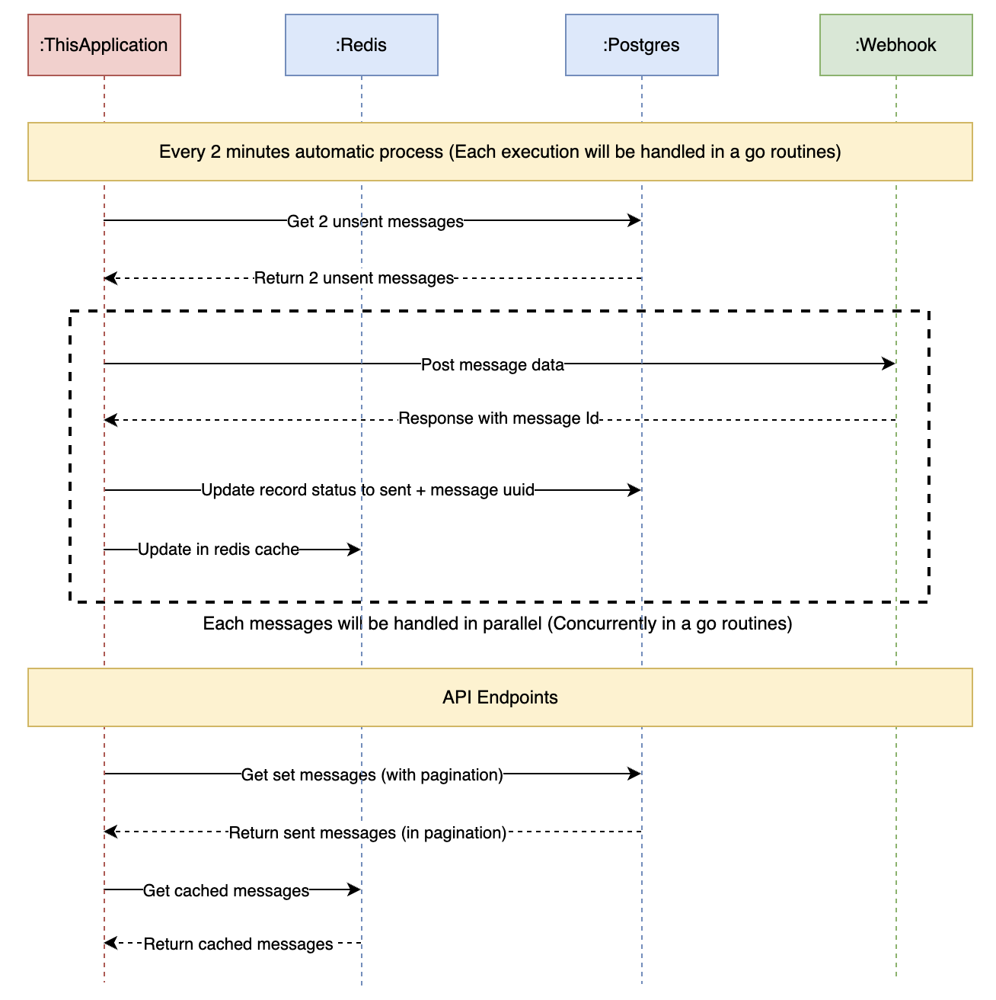
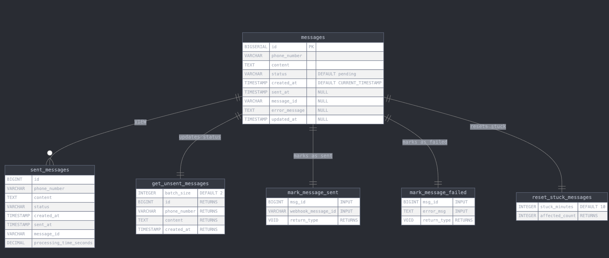

# Overview
This project is interview test from Insider for Senior Golang Developer role

# Analyzing
For start and stop feature. I will run the automated service in a dedicated thread. When start/stop signal sent
it will cancel or create a new go routine for that specific automation service (decoulple the lifecycle of the
rest api request with the service running in background)

The requirements only says process 2 message every 2 mins. But I have extended so this project can process way more messages than required.
- Every 2 minutes (Using tick lib from the parent routine - This always run when the service started) -> Push new messages into a channel that has buffer.
- There will be a set of workers - each is a dedicated go routine that listen to the channel above. This will make all message handled concurently.
- To avoid getting the same message from the db, I will create a postgres function that will get oldest pending messages and lock those rows and change the status from pending -> proccessing. This will avoid messages being handled multiple times.

>Note: This design is to get at-least once pattern. If we need exactly once -> should use event-driven.

There are still small edge-cases where by the notification sent but not updated to DB (network/sudden death issue). To tackle this problem, I can do some prediodically scanning for messages in failed/processing status for longer than X amount of minutes and handled them there. But that is out of scope for this project.

# Architecture Design

Overview Logical/Sequence diagram:


Database design:


# Code Structure
```
.
├── .golangci.yaml                      # Store linting config
├── .air.toml                           # Hot reload config
├── .env.example                        # Sample env
├── Dockerfile                          # Application Dockerfile
├── LICENSE
├── README.md
├── build                               # This is the DB initialize file content
│   └── init.sql
├── cmd
│   └── server
│       └── main.go                     # Main.go file - entrypoint of the server
├── devbox.json                         # Development env configuration file - similar to package.json
├── devbox.lock
├── docker-compose.yml                  # Docker-compose for the whole system
├── docker-compose.dev.yml              # Docker-compose for dev env (without the application container)
├── docs                                # Docs related (design docs, swagger etc)
├── e2e                                 # e2e testing
├── internal                            # Main logic
    ├── api                             # API management
    │   ├── middleware
    │   │   └── logging.go
    │   └── route
    │       ├── health.go
    │       ├── message.go
    │       └── setup.go
    ├── bootstrap                       # This is all Dependency between layers created
    │   └── app.go
    ├── controller                      # Controller layer
    ├── domain                          # Domain Layer
    │   ├── dto
    │   ├── entity
    │   └── interfaces                  # This include interfaces for usecase/controller/repo layers
    ├── repository                      # Repo layer implementation
    ├── usecase                         # Usecase layer implementation
    ├── shared                          # Shared function (logging, etc)
    └── utils                           # Util functions
```

# How to setup
This section guide how to setup the repository. Personally, I like to use Devbox - which is similar with package.json for javascript. But Devbox supports to have all required libraries/binaries for your dev env as well as scripting utilities. You can use or not, please looks into ***./devbox.json*** file for all util script.

## Prerequisites
- Devbox: [link](https://www.jetify.com/devbox)

Devbox will installs:
- earthly@latest
- go@1.24.3
- trufflehog@latest
- air@latest
- golangci-lint@latest
- psqlodbc@latest

## Guidelines
The project and all of it's system is setup using docker-compose.

1. If you are using devbox then it's quite simple
```
devbox shell
devbox run up
```

To shut it down:
```
devbox run down
```

>***devbox shell*** will create a shell where it has all required libraries with the exact version declared in devbox.json

>***devbox up*** will setup docker-compose

2. If you don't want to use devbox
<br>
Just need to run ```docker-compose up -d``` 
<br>
<br>
For other utils:
and look into ***devbox.json*** for the required command

# Development Guide
1. Run docker-compose.dev file
<br>
This file only contains system containers (redis, postgres)

2. Copy .env.example -> .env
<br>
Then config the env webhook

3. Go into Devbox shell (Optional)
<br>
Run ```devbox shell```

4. Enable hot reloading
<br>
Run ```air```

5. Some util commands:
- ```devbox run sql```: This will put you into the postgres container directly so you can do query there.
- ```devbox run redis```: This will put you into the redis container so you can check inside redis with ease.
- ```devbox run lint```: This will execute and check lint for the repo
- ```devbox run scan```: This will scan the repo using Trufflehog for all possible secret leak.
- ```devbox run up```: Deploy the docker-compose
- ```devbox run down```: Tear down the docker-compose resources
- ```devbox run api-gen```: This will generate swagger file from the src code and place it in ***./docs/swagger.json***
- ```devbox run test```: This will run all test cases
 
# Result

### Checklist:
- [x] Retrieve message content, recipient phone number, and sending status for each
record from the Database. Character limit is required for message content.
- [x] Upon project deployment, automatic message sending should -start, processing all
unsent records in the database.
- [x] Messages that have been sent once should not be resent. Newly added records should
be sent in the subsequent automatic process.
- [x] (Bonus Item) - After sending a message, cache to Redis the messageId value received
from the response along with the sending time.

Additional:
- [x] The project should feature 2 separate API endpoints:
    + Start/Stop automatic message sending
    + Retrieve a list of sent messages

Myself-made up:
- [x] Nice Logging
- [x] Can custom duration/batch/maxWorkers
- [x] Follow with clean architecture
- [x] No lint error
